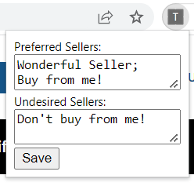
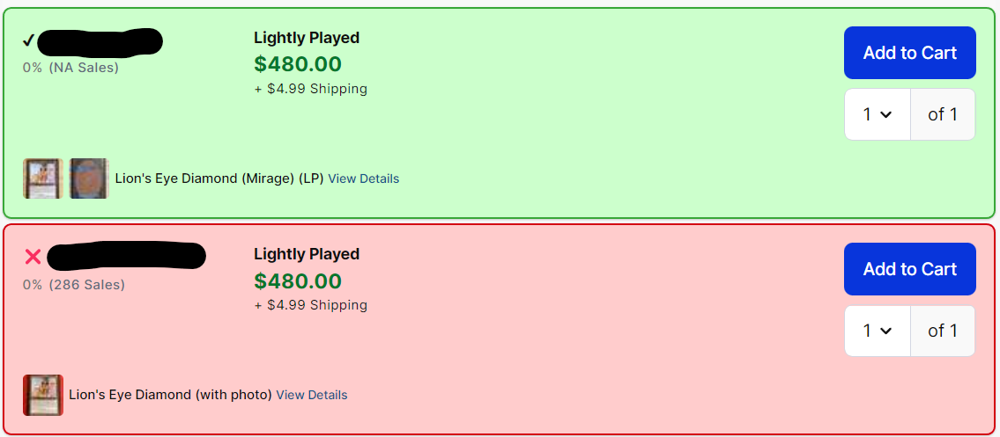
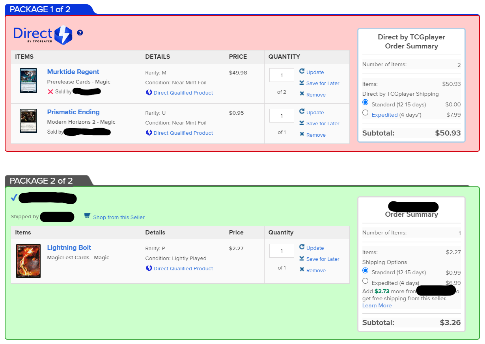

# TCGplayer Seller Flagger
This is a Firefox extension to flag preferred and undesired TCGplayer sellers.

## Instructions for use
All seller names must be separated by semi-colons. Seller names are case sensitive. Spaces and newlines are allowed.

